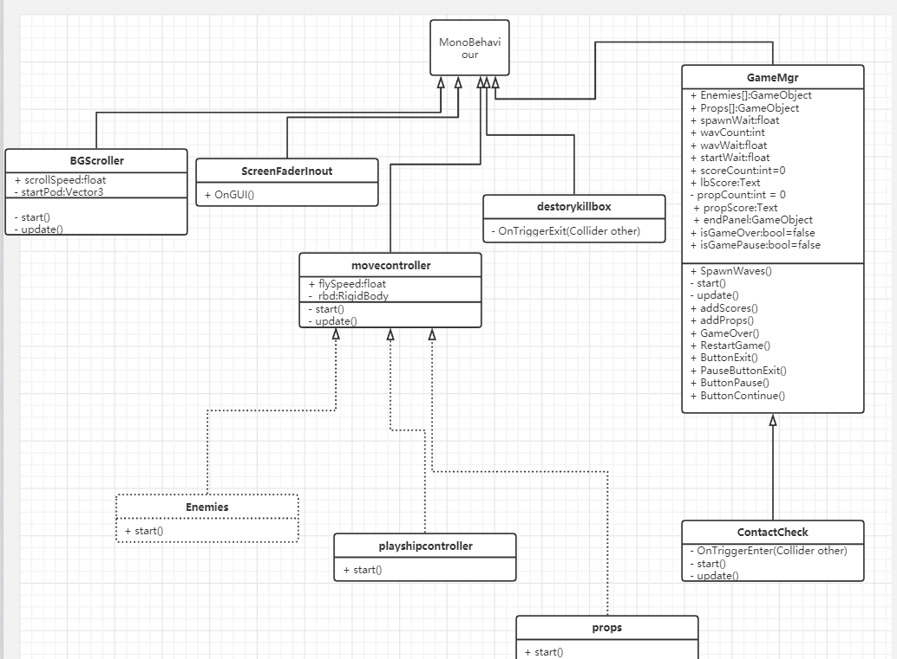
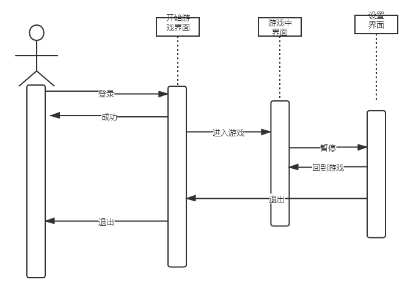
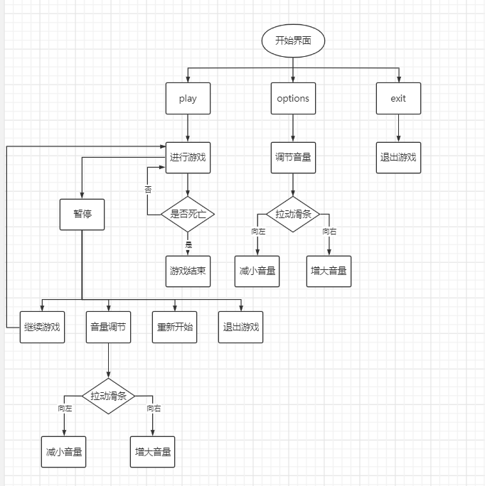
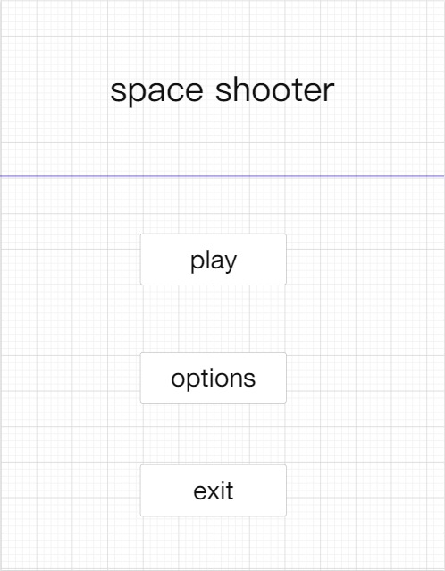
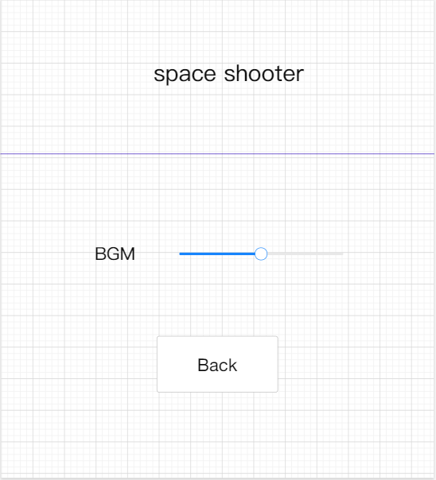
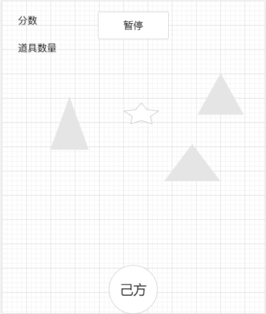
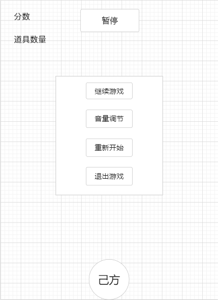

# SpaceShooter系统设计说明书
## 一、类图

关于图中各类的说明如下
### 1.1 BGScroller
抽象类，表示有关游戏背景的物体   
+ scrollSpeed：背景板移动速度
+ startPos：背景板起始位置
+ start()：获取起始位置
+ update()：更新位置
### 1.2 ScreenFadeinout
抽象类，用于实现场景切换时的淡入淡出效果
+ Fade:调节参数
+ FadeIn：淡入标志
+ Fadeout：淡出标志
+ OnGui():控制调节淡入淡出效果
### 1.3 MoveControoler
控制各种物体飞行的脚本
+ rbd：定义一个刚体
+ flyspeed：定义飞行速度
+ start()：控制物体飞行
### 1.4 destroyKillerbox
抽象类，用于清除被消灭物体的内存以及飞出边界物体的内存
+ OnTriggerExit()：用于清除内存
### 1.5 GameMgr
游戏控制类，用于控制整个游戏的进程，包括游戏ui界面显示，界面的转场，游戏内玩家的控制，敌人的控制等。
+ public GameObject \[]Enemies;//定义游戏中敌人的数组
+ public GameObject \[]props;//定义游戏中道具的数组
+ public GameObject \[]bosses;//定义boss的数组
+ public float spawnWait;//每生成一个敌人的间隔
+ public int wavCount;//每一波生成敌人的数量
+ public float wavWait;//每波敌人的等待间隔
+ public float startWait;//游戏开始时生成敌人之前的等待时间
+ public float propspawnWait;//每生成一个道具的间隔
+ public int propwavCount;//每一波生成道具的数量
+ public float propwavWait;//每波道具的等待间隔
+ public float propstartWait;//游戏开始时生成道具之前的等待时间
+ public float bossspawnWait;//每生成一个敌人的间隔
+ public int bosswavCount;//每一波生成敌人的数量
+ public float bosswavWait;//每波敌人的等待间隔
+ public float bossstartWait;//游戏开始时生成敌人之前的等待时间

**//UI相关**
+ private int scoreCount=0;//游戏开始时初始游戏分数
+ public Text lbScore;//显示分数变化
+ private int propCount=0;//游戏开始时初始道具数量
+ public Text propScore;//显示道具数量变化
+ public bool isGameOver=false;//判断游戏是否结束
+ public bool isGamePause =false;//判断游戏是否暂停
+ public void addScore(int value);//增加分数
+ public void addprops(int value);//战机增益效果
+ public void GameOver();//控制游戏结束
+ public void RestartGame();//重新加载场景
+ public void ButtonExit();//返回主界面
+ public void PauseButtonExit();//游戏中暂停
+ public void ButtonPause();//暂停游戏
+ public void ButtonContinue();//从暂停中恢复
### 1.6 各类之间的关系
Movecontroller有三个子类，分别是：Enemies、playership、props。分别代表：敌方战机类，我方战机类以及游戏道具类；GameMgr有一个子类：ContactCheck碰撞检测类。
## 二、顺序图

## 三、流程图

## 四、UI设计
### 4.1 开始界面

+ 游戏LOGO
+ 开始游戏的按钮play
+ 音量调节的按钮options
+ 退出游戏按钮exit
### 4.2 音量调节界面

+ 调节的滑条(向左为调小，向右为调大)
+ 返回按钮back
### 4.3 游戏界面

+ 暂停按钮
+ 得分显示
+ 道具数量显示
+ 己方战机
+ 敌方战机
+ 障碍物
+ 道具
### 4.4 暂停界面

+ 继续游戏按钮
+ 音量调节按钮
+ 重新开始按钮
+ 退出游戏按钮
## 五、数据库设计
由于本游戏设计为单机游戏，与数据库交互较少，暂时未有添加数据库的想法。
